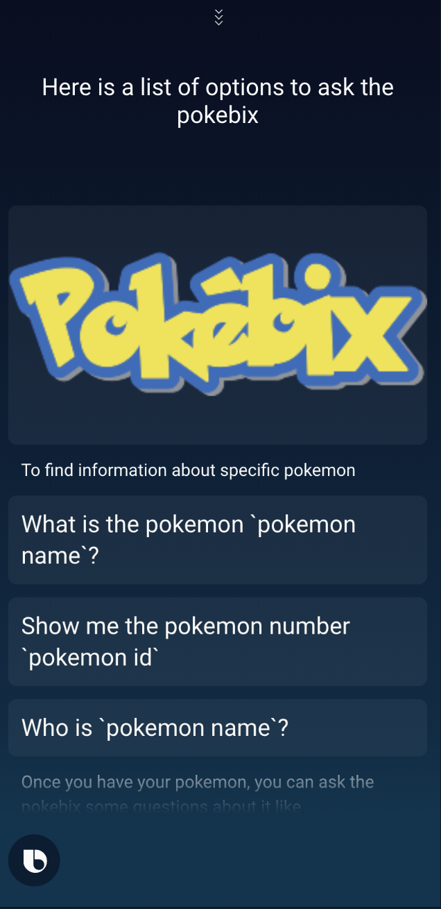

# Project Name: PokéBix
  PokéBix is a voice activated Pokédex that allows you to easily find detailed information about your favorite Pokémon. To bring up a list of features say "Pokebix help" after running the capsule.
## Team Members: 
- Collin Brill – https://github.com/damiandominodavis
- Ariella Grodzinsky – https://github.com/blairclair
- Scott Snelgrove – https://github.com/ssnelgrove314 

## Why Should It Win?
PokéBix demonstrates how to query multiple endpoints of an API to build models, which PokéBix uses to design views based off of custom layouts made to simulate a real Pokédex. Pokémon lovers will delight in being able to ask their PokéBix questions, just like Ash did in the original show!

## Examples
1. PokeBix help

2. What is the pokemon Pikachu?

